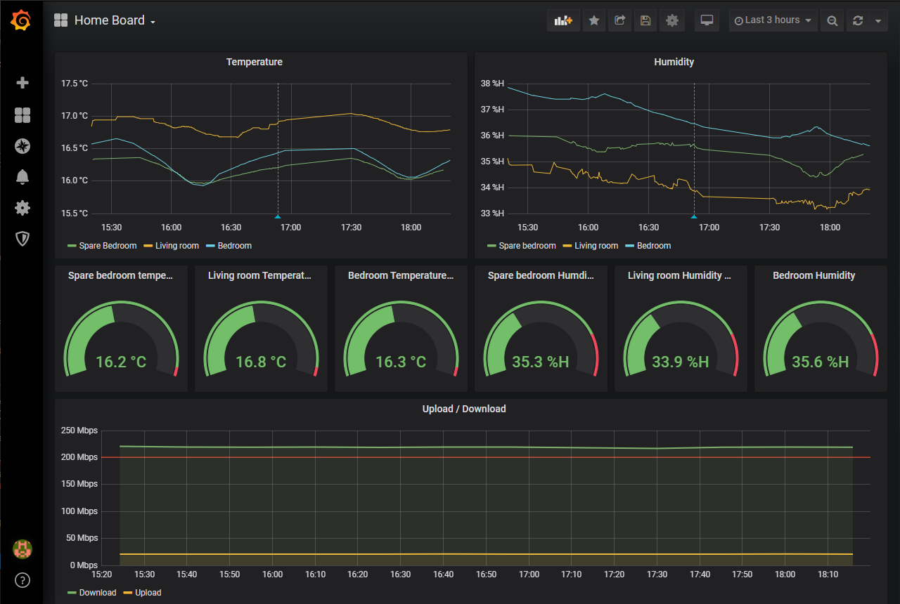

### Nota smarthome dashboard

Creating a dashboard/common place for my smart home things and bit of a learning exercise, currently has temperature data from Ruuvitags, internet speed test results and Octopus energy readings. Any of the following folders that aren't needed can be deleted ( `octograph`/`ruuvitag`/`speedtest-grafana`), just remember update the `Makefile` so it doesn't look for those compose files which may have been deleted.

Recently got a bunch of Ruuvitags and wanted to make a nice dashboard for everyone in the house to look at. I already had the speedtest image running and uploading to influxdb/grafana so just merged that with the ruuvitag repo initially.

With nginx, i've stripped down the number of exposed to the bare minimum ( most are for the bluetooth -> mosquitto containers) and made everything easily accessible via url routes.

Don't use this for anything "production" wise, I just run all this off a raspberry pi on my network ( its not exposed externally at all). Grafana doesn't have a password and the influxdb uses trash pwds too.

#### Start/stop most things

At the moment there is a Makefile that has bunch of commands in it, to start and stop everything use the commands below:

e.g. `make compose-up` or `make compose-down`

### Access things

http://localhost/grafana - access the grafana dashboard

http://localhost/hive - access the hive ui for monitor incoming messages from the bt-mqtt-gateway

http://localhost/node-red - viewing the node-red ui for viewing message related flows

### Ruuvitag monitoring

I've used the docker-compose setup from https://github.com/koenvervloesem/ruuvitag-demo and stripped out all the demo related parts.

Pulled the influxdb and grafan part of this up a level

I had issues where the bt-mgtt-gateway would stop processing bluetooth messages intermittently, after making sure all my bluetooth related things were up to date I now just restart this container every 20 minutes ( using `make restart-bt-gateway` ) and it seems to be working much better now.
Would recommend the bluetooth updates aswell though.

### Speedtest grafana 

Used to have this running in isolation https://github.com/frdmn/docker-speedtest-grafana but I've pulled into into this repo ( stripping out everything I didn't need )

Pulled the influxdb and grafana parts of this up a level too.

### Octograph

Based on https://github.com/stevenewey/octograph but refactored to use my the single grafana and influxdb.

You can build and run the docker image using the `make build-octograph` and `make run-octograph` goals respectively. The `run-octopgraph` target makes sure to run on the same network as influxdb.

I have the run script being called once a day from cron.

### Weather

Based on https://github.com/Notaphish/nota_openweather_influxdb but refactored to use a single grafana and influxdb

Build using the `make build-weather` target and run it with `run-weather` target. The `run-weather` target makes sure to run on the same network as influxdb.

I have the `run` target being called every 5 minutes from cron.